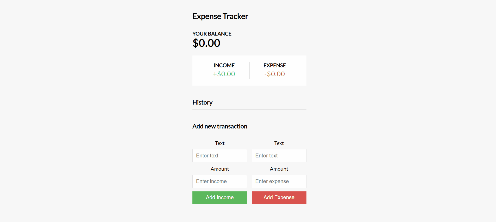

# Expense Tracker


This is a MERN stack based application for tracking daily expenses. It has functionality for adding and deleting expenses. 

## Installation

For running this app on your local system, clone the repo and use the following command.

```bash
npm run build
```


## Contributing
Pull requests are welcome. For major changes, please open an issue first to discuss what you would like to change.

Please make sure to update tests as appropriate.

## License
[MIT](https://choosealicense.com/licenses/mit/)